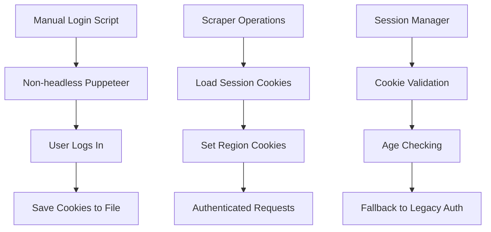

# Vinted Persistent Authenticated Session

## Overview

JewelHuntrix now supports persistent authenticated sessions with Vinted, eliminating the need for repeated logins and providing reliable access to saved searches and authenticated content.

## 🔐 Features

- **One-time manual login** with non-headless Puppeteer browser
- **Persistent cookie storage** in JSON file for reuse
- **Automatic session loading** for all scraper operations
- **Region persistence** (France/NL) to prevent location popups
- **Session validation and monitoring** tools
- **Fallback support** for legacy environment variable authentication

## 🚀 Quick Start

### 1. Manual Login (One-time setup)

```bash
# Run the manual login script
npm run vinted:login
```

**What happens:**
- Non-headless browser opens automatically
- Navigate to `https://www.vinted.nl`
- **You manually log into your Vinted account**
- Script detects successful login automatically
- All cookies are saved to `./data/vinted-session.json`
- Browser closes automatically after saving

### 2. Verify Session

```bash
# Check session status
npm run vinted:status
```

Expected output:
```
✅ Session Status: ACTIVE
📁 Source: file
🍪 Cookies: 15 loaded
📅 Age: 0 days old
🔐 Authentication: VALID
🎉 Ready for authenticated scraping!
```

### 3. Start Scraping

Once authenticated, all scraper operations automatically use the saved session:
```bash
# The scraper will now use your persistent session
npm run dev
```

## 📋 Available Commands

| Command | Description |
|---------|-------------|
| `npm run vinted:login` | Launch manual login in non-headless browser |
| `npm run vinted:status` | Check current session status and validity |
| `npm run vinted:reset` | Delete session file for fresh login |

## ⚙️ Configuration

### Environment Variables

Add to your `.env` file:

```bash
# Session file path (optional, default: ./data/vinted-session.json)
VINTED_SESSION_FILE=./data/vinted-session.json

# Region preference (FR or NL, default: NL)
VINTED_REGION=NL

# Legacy fallback (optional)
VINTED_SESSION_COOKIE=your_session_cookie
VINTED_AUTH_TOKEN=your_auth_token
```

### File Structure

```
project/
├── data/
│   └── vinted-session.json    # Saved session cookies
├── scripts/
│   ├── manual-vinted-login.js # Login script
│   ├── check-session.js       # Status checker
│   └── reset-session.js       # Session reset
└── server/
    └── utils/
        └── cookie-manager.ts  # Session management utilities
```

## 🔧 Technical Details

### Session Format

The session file contains:
```json
{
  "cookies": [
    {
      "name": "_vinted_fr_session",
      "value": "session_value",
      "domain": ".vinted.nl",
      "path": "/",
      "httpOnly": true,
      "secure": true
    }
  ],
  "metadata": {
    "savedAt": "2024-12-09T09:48:00.000Z",
    "userAgent": "Mozilla/5.0...",
    "region": "NL"
  }
}
```

### Cookie Management

The `CookieManager` class provides:
- **Automatic session loading** from file or environment
- **Region cookie injection** to prevent location popups
- **Session validation** with age checking
- **Fallback authentication** support

### Integration

Updated `vinted-scraper.ts` now:
1. Loads persistent cookies before any Vinted visit
2. Sets region cookies automatically
3. Uses authenticated session for all requests
4. Maintains retry logic and error handling

## 🛠️ Troubleshooting

### No Session Found

```bash
❌ No valid session found

💡 Solutions:
  1. Run manual login: npm run vinted:login
  2. Set VINTED_SESSION_COOKIE environment variable
  3. Check if session file exists and is valid
```

**Solution:** Run `npm run vinted:login` and log in manually.

### Expired Session

```bash
⚠️ Warning: Session is older than 30 days, may need refresh
```

**Solution:** Run `npm run vinted:reset` then `npm run vinted:login`.

### Authentication Failed

```bash
❌ Authentication: INVALID
💡 Session may be expired or corrupted
```

**Solution:** 
1. Check session status: `npm run vinted:status`
2. Reset if needed: `npm run vinted:reset`
3. Login again: `npm run vinted:login`

### Browser Issues

If the manual login browser doesn't open or has issues:
1. Ensure Puppeteer is installed: `npm install puppeteer`
2. Check browser permissions
3. Try running with verbose logging

## 🔄 Migration from Legacy Auth

If you were using `VINTED_SESSION_COOKIE` environment variable:

1. **Run manual login:** `npm run vinted:login`
2. **Verify new session:** `npm run vinted:status`
3. **Remove old env var** (optional - fallback still works)
4. **Test scraping** with authenticated session

## 🏗️ Architecture



## 📈 Benefits

### Reliability
- **No more repeated logins** - session persists across scraper runs
- **Saved searches access** - authenticated users can monitor saved searches
- **Better rate limiting** - authenticated sessions have higher limits

### User Experience
- **One-time setup** - login once, use forever
- **Session monitoring** - tools to check session health
- **Easy reset** - simple commands to reset if needed

### Technical
- **Automatic region setting** - prevents "Where do you live?" popups
- **Session validation** - checks cookie freshness and validity
- **Fallback support** - works with legacy environment variables

## 🚨 Important Notes

1. **Session Security:** The session file contains sensitive authentication data. Keep it secure and don't commit to version control.

2. **Session Expiration:** Vinted sessions may expire after ~30 days. The system will warn you when sessions are old.

3. **Single Account:** The persistent session is tied to one Vinted account. To use a different account, reset and login again.

4. **Region Consistency:** The session maintains your chosen region (FR/NL) to ensure consistent search results.

## 🎯 Next Steps

With persistent authentication implemented:
1. ✅ **Run manual login** to establish your session
2. ✅ **Test authenticated scraping** with your saved searches
3. ✅ **Monitor session health** using the status checker
4. ✅ **Enjoy reliable automated scanning** without login interruptions!

The JewelHuntrix scraper now provides enterprise-level reliability with persistent authenticated sessions! 🎉